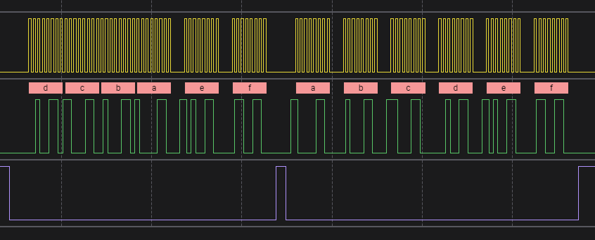
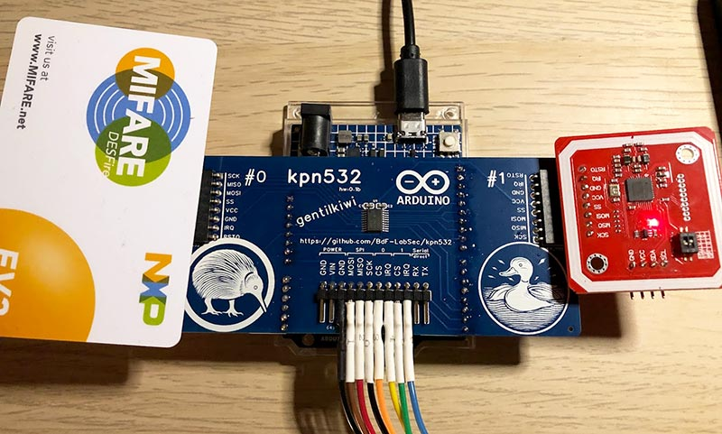
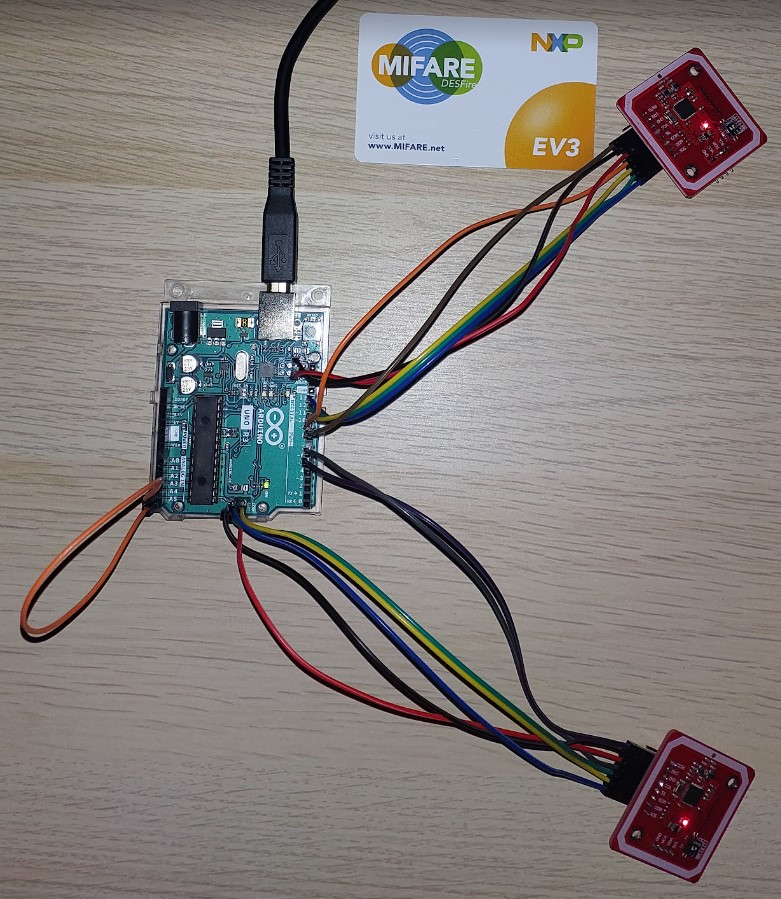
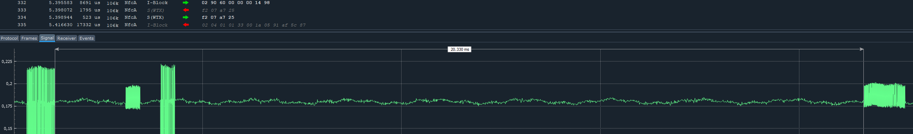
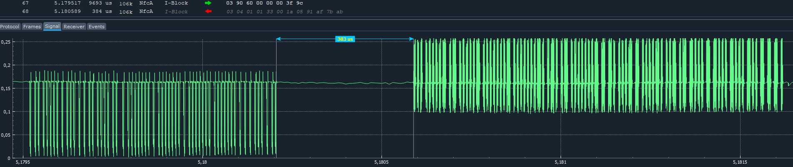
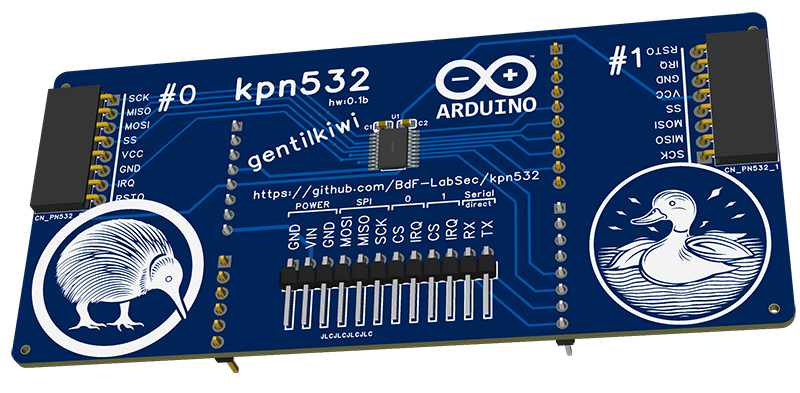

# kpn532

## Arduino PN532 proxy (mini relay).

This is a minimal SPI library using IRQ instead of status polling, compatible with:
- Arduino Uno R3 - @ 4 MHz
- Arduino Uno R4 Minima (maybe WiFi too?) - @ 3 MHz

(see `kpn532_spi.h` to know why this 1 MHz does not make a lots of differences)


## Hardware list

- 1 x Arduino Uno R3
- 2 x Elechouse NFC Module V3 (or V4)
- 14 x Dupont wires - or a [kpn532 relay board](#kpn532-board) :)
    - 7 x F/M
    - 7 x F/F

### Arduino Uno R4 vs. Elechouse PN532 boards

_Or why to start with a Uno R3..._

#### Bits and Bytes order...

First versions of Uno R4 SPI Class had a bug when dealing with `LSB` settings: bits were reversed, but bytes too... creating problems when transfering blocks.



It was fixed by @RudolphRiedel (https://github.com/arduino/ArduinoCore-renesas/pull/246). Thanks to him, we now have correct & efficient SPI transfer.

#### Logical level

Arduino R3 & R4 boards are both using 5V logical level (`1` is ~5V), but Elechouse PN532 boards are using : "On-board level shifter, Standard 5V TTL for I2C and UART, 3.3V TTL SPI"

We were lucky with Arduino R3:
- (ATmega328P) R3 `1`: 0.6xVCC: 3V, tolerant to 2.4V (measured)
- (Renesas RA4M1) R4 `1`: 0.8xVCC: 4V, tolerant to 3.1V (measured)

Unfortunately, the Elechouse PN532 SPI is ~3V (sometimes even ~2.9V).  It makes some `1` (from PN532 point of view) to be read as `0` (on the Ardunion Uno R4). It's particularly annoying with `IRQ` signals.

- PN532 is nice with our 5V output signals instead of 3V (`SCK`, `MOSI`, `CS`) - _but it's not ideal_,
- Arduino Uno R4 is less nice, and have problem with `MISO` and `IRQ`.

It can be _solved_ with a level shifter: search on Amazon for `TXS0108E Logic Level Converter` - or build a [kpn532 board](#kpn532-board) (rely on `TXS0108EPWR`)


## Wiring diagram

```
              ARDUINO                                 READER                           EMULATOR
                             +-----+
+----[PWR]-------------------| USB |--+    .. -------------------------     .. -------------------------
|                            +-----+  |    .. -------------------------\\   .. -------------------------\\
|        GND[a][ ]RST2                |        ELECHOUSE NFC MODULE V3 ||       ELECHOUSE NFC MODULE V3 ||
|      MOSI2[ ][ ]SCK2      A5/SCL[ ] |        [ ] [ ] [ ] [ ]    __   ||       [ ] [ ] [ ] [ ]    __   ||
|         5V[b][ ]MISO2     A4/SDA[ ] |        SCL SDA VCC GND   /  \  ||       SCL SDA VCC GND   /  \  ||
|                             AREF[ ] |                          \__/  ||                         \__/  ||
|                              GND[ ] |     1|#_|ON  (SPI)             ||    1|#_|ON  (SPI)             ||
| [ ]N/C                    SCK/13[c] |     2|_#|KE            SCK[c]  ||    2|_#|KE            SCK[i]  ||
| [ ]IOREF                 MISO/12[d] |                       MISO[d]  ||                      MISO[j]  ||
| [ ]RST                   MOSI/11[e]~|           |||||       MOSI[e]  ||          |||||       MOSI[l]  ||
| [ ]3V3    +---+               10[f]~|          +-----+        SS[f]  ||         +-----+        SS[n]  ||
| [ ]5v    -| A |-               9[n]~|         -|PN532|-      VCC[b]  ||        -|PN532|-      VCC[m]  ||
| [ ]GND   -| R |-               8[ ] |          +-----+       GND[a]  ||         +-----+       GND[k]  ||
| [ ]GND   -| D |-                    |           |||||        IRQ[g]  ||          |||||        IRQ[o]  ||
| [ ]Vin   -| U |-               7[ ] |                       RSTO[ ]  ||                      RSTO[ ]  ||
|          -| I |-               6[ ]~|    |HSU| 0 | 0                 ||   |HSU| 0 | 0                 ||
| [ ]A0    -| N |-               5[ ]~|    |I2C| 1 | 0                 ..   |I2C| 1 | 0                 ..
| [ ]A1    -| O |-               4[ ] |    |SPI| 0 | 1                 ..   |SPI| 0 | 1                 ..
| [ ]A2     +---+           INT1/3[g]~|
| [ ]A3                     INT0/2[o] |    SHARED        a <-> k (GND)      READER ONLY        f (SS)
| [p]A4/SDA  RST SCK MISO     TX>1[ ] |                  b <-> m (5V)                          g (IRQ)
| [q]A5/SCL  [ ] [i] [j]      RX<0[ ] |                  c <-> i (SCK)      EMULATOR ONLY      n (SS)
|            [k] [l] [m]              |                  d <-> j (MISO)                        o (IRQ)
|  UNO R3    GND MOSI 5V  ____________/                  e <-> l (MOSI)
 \_______________________/
```

### Updates
- IRQ are now on pin 3 & 2 (only ones available on R3 for real IRQ)
- No more minimal/verbose pin - use specific firmware (outputs slow down the relay)


## Pictures

### New version with `kpn532 board`



### Previous version with wires and previous pinning




## Programming

Arduino IDE is enough to handle build and flash to devices, but you can also flash binaries with:

- `avrdude` - with HEX file - for Arduino Uno R3 (or another programmer)
```
> avrdude -p atmega328p -c arduino -P COM8 -b 115200 -D -U flash:w:kpn532.hex:i
```

- `dfu-util` - with BIN file - for Arduino Uno R4 (or another programmer)
```
> dfu-util --list

dfu-util 0.11

Copyright 2005-2009 Weston Schmidt, Harald Welte and OpenMoko Inc.
Copyright 2010-2021 Tormod Volden and Stefan Schmidt
This program is Free Software and has ABSOLUTELY NO WARRANTY
Please report bugs to http://sourceforge.net/p/dfu-util/tickets/

Found DFU: [2341:0369] ver=0100, devnum=50, cfg=1, intf=0, path="1-7.2.1.2", alt=1, name="@DataFlash /0x08000000/8*1Kg", serial="370B0B185931393864FA33324B572E3F"
Found DFU: [2341:0369] ver=0100, devnum=50, cfg=1, intf=0, path="1-7.2.1.2", alt=0, name="@CodeFlash /0x00000000/8*2Ka,120*2Kg", serial="370B0B185931393864FA33324B572E3F"
```

Use the `@CodeFlash` one (here, `alt=0`)
```
> dfu-util --serial 370B0B185931393864FA33324B572E3F --alt 0 --reset --download kpn532.ino.bin
dfu-util 0.11

Copyright 2005-2009 Weston Schmidt, Harald Welte and OpenMoko Inc.
Copyright 2010-2021 Tormod Volden and Stefan Schmidt
This program is Free Software and has ABSOLUTELY NO WARRANTY
Please report bugs to http://sourceforge.net/p/dfu-util/tickets/

Warning: Invalid DFU suffix signature
A valid DFU suffix will be required in a future dfu-util release
Opening DFU capable USB device...
Device ID 2341:0069
Run-Time device DFU version 0101
Claiming USB DFU (Run-Time) Interface...
Setting Alternate Interface zero...
Determining device status...
DFU state(0) = appIDLE, status(0) = No error condition is present
Device really in Run-Time Mode, send DFU detach request...
Device will detach and reattach...
Opening DFU USB Device...
Claiming USB DFU Interface...
Setting Alternate Interface #0 ...
Determining device status...
DFU state(2) = dfuIDLE, status(0) = No error condition is present
DFU mode device DFU version 0101
Device returned transfer size 64
Copying data from PC to DFU device
Download        [=========================] 100%        61936 bytes
Download done.
DFU state(7) = dfuMANIFEST, status(0) = No error condition is present
DFU state(2) = dfuIDLE, status(0) = No error condition is present
Done!
Resetting USB to switch back to Run-Time mode
```


## Performance

Measured _waiting_ time for `GetVersion` instruction (`0x60`) is ~20,3ms. Two `WTX` frames are present bewtween.



A normal _waiting_ time is around ~383µs for this instruction



The proxified penalty is around 20ms, more or less depending on the payload size.

You can check timings with `SDR nfc-laboratory v2.0`


## Behavior

### Presented UID
Presented UID can be different from the original.
- Original UID: `0495910A5D6D80`
- Presented UID: `0895910A`
    - `08` is forced by `PN532` design ;
    - Only 4 bytes in total, 3 bytes available.

### Seen as `Felica`
Sometimes the presented card can be seen as `Felica`. Move the original card to a better position on the antenna, then try again (with a `reset`).


## Traces

With a NXP TagInfo scan

### Minimal mode

```
  .#####.         mimicard 0.1 (Arduino - single board)
 .## ^ ##.__ _    "A La Vie, A L'Amour" - (oe.eo)
 ## / \ /   ('>-
 ## \ / | K  |    /*** Benjamin DELPY `gentilkiwi`
 '## v #\____/         benjamin.delpy@banque-france.fr
  '#####' L\_          Kiwi PN532                      ***/

| Verbosity: minimal
| Reader init...
|   PN532 version 1.6.7
| Emulator init...
|   PN532 version 1.6.7
| Initialization OK!
~ Waiting for target...
| Detected target
|   SENS_RES: 0344
|   SEL_RES : 20
|   UID     : 0495910A5D6D80
~ Waiting for reader on emulator...
| Reader detected!
| Target released
```

### Verbose

- `<` from reader
- `>` to reader

```
  .#####.         mimicard 0.1 (Arduino - single board)
 .## ^ ##.__ _    "A La Vie, A L'Amour" - (oe.eo)
 ## / \ /   ('>-
 ## \ / | K  |    /*** Benjamin DELPY `gentilkiwi`
 '## v #\____/         benjamin.delpy@banque-france.fr
  '#####' L\_          Kiwi PN532                      ***/

| Verbosity: full
| Reader init...
|   PN532 version 1.6.7
| Emulator init...
|   PN532 version 1.6.7
| Initialization OK!
~ Waiting for target...
| Detected target
|   SENS_RES: 0344
|   SEL_RES : 20
|   UID     : 0495910A5D6D80
~ Waiting for reader on emulator...
We got a reader! : 08E080
| Reader detected!
< 9060000000
> 04010133001A0591AF
< 00A4040007D276000085010100
> 6A82
< 00A4040007D2760000850100
> 9000
< 00A4000002E103
> 6A82
< 905A00000300000000
> 9100
< 9060000000
> 04010133001A0591AF
< 905A00000300000000
> 91CA
< 9060000000
> 04010133001A0591AF
< 90AF000000
> 04010103001A0591AF
< 90AF000000
> 0495910A5D6D80995367303020209100
< 905A00000300000000
> 9100
< 00A4040007D276000085010100
> 6A82
< 900A0000010000
> 214FC51AB696135491AF
< 90AF00001000000000000000004C066583A1B1DCDF00
> CC0B2E2555EA033D9100
< 906A000000
> 9100
< 906E000000
> 0020009100
< 906D000000
> 9100
< 905A00000300000000
> 9100
< 905A0000033010F200
> 91A0
< 905A00000300000000
> 9100
< 905A0000039011F200
> 91A0
< 905A00000300000000
> 9100
< 905A00000300805700
> 91A0
< 905A00000300000000
> 9100
< 905A00000342220100
> 91A0
< 905A00000300000000
> 9100
< 905A000003444D0100
> 91A0
< 905A00000300000000
> 9100
< 905A0000030011F200
> 91A0
< 905A00000300000000
> 9100
< 905A00000331594F00
> 91A0
< 905A00000300000000
> 9100
< 905A00000300407800
> 91A0
< 905A00000300000000
> 9100
< 905A0000031120EF00
> 91A0
< 905A00000300000000
> 9100
< 905A00000353453100
> 91A0
< 905A00000300000000
> 9100
< 905A00000303B80000
> 91A0
< 903C0000010000
> 131C43204449CBAF8BDE7E643EE0F778BAF778CC122991EC034737CFCE0161B2DF1C5FE2C5576FFE9B92221A2ABAAC35733984682EF679E29190
< 905A00000300000000
> 9100
< 900A0000010000
> E41FD3FD41BE737B91AF
< 90AF0000100000000000000000A2D341711D007C9300
> CC0B2E2555EA033D9100
< 9045000000
> 0F019100
< 906A000000
> 9100
< 905A00000300000000
> 9100
< 9060000000
> 04010133001A0591AF
< 90AF000000
> 04010103001A0591AF
< 90AF000000
> 0495910A5D6D80995367303020209100
| Target released
```

### TagInfo side

```
** TagInfo scan (version 4.25.5) 2022-12-22 23:43:24 **
Report Type: -- IC INFO ------------------------------

# IC manufacturer:
NXP Semiconductors

# IC type:
MIFARE DESFire EV3 (MF3D83)

-- NDEF ------------------------------

# No NDEF data storage populated:

-- EXTRA ------------------------------

# Memory information:
Size: 8 kB
Available: 8.0 kB (8192 bytes)

# IC information:
Capacitance: 17 pF

# Version information:
Vendor ID: NXP (0x04)
Hardware info:
* Type/subtype: 0x01/0x01
* Version: 3.0
* Storage size: 8192 bytes (0x1A)
* Protocol: ISO/IEC 14443-4 (0x05)
Software info:
* Type/subtype: 0x01/0x01
* Version: 3.0
* Storage size: 8192 bytes (0x1A)
* Protocol: ISO/IEC 14443-4 (0x05)
Production date: week 20, 2020 (0x2020)

# Authentication information:
Default PICC master key

# Originality Check (asymmetric):
Signature could not be verified with NXP public key

# Originality Check (symmetric):
Originality Check not successful

# TagInfo Version:
Version :4.25.5

# Device Info:
Device Model :samsung ( SM-T636B )
Android OS Version :12

-- FULL SCAN ------------------------------

# Technologies supported:
ISO/IEC 7816-4 compatible
Native DESFire APDU framing
ISO/IEC 14443-4 (Type A) compatible
ISO/IEC 14443-3 (Type A) compatible
ISO/IEC 14443-2 (Type A) compatible

# Android technology information:
Tag description:
* TAG: Tech [android.nfc.tech.IsoDep, android.nfc.tech.NfcA, android.nfc.tech.NdefFormatable]
* Maximum transceive length: 65279 bytes
* Default maximum transceive time-out: 618 ms
* Extended length APDUs supported
* Maximum transceive length: 253 bytes
* Default maximum transceive time-out: 618 ms
MIFARE Classic support present in Android

# Detailed protocol information:
ID: 08:95:91:0A
* Random ID
ATQA: 0x4403
SAK: 0x20
ATS: 0x067533920380
* Max. accepted frame size: 64 bytes (FSCI: 5)
* Supported receive rates:
	- 106, 212, 424 kbit/s (DR: 1, 2, 4)
* Supported send rates:
	- 106, 212, 424 kbit/s (DS: 1, 2, 4)
* Different send and receive rates supported
* SFGT: 1.208 ms  (SFGI: 2)
* FWT: 154.7 ms  (FWI: 9)
* NAD supported
* CID supported
* Historical bytes: 0x80 |.|

# Memory content:

Application ID 0x000000 (PICC)
* Default master key
* Key configuration: (0x0F01)
  - 1 (3)DES key
  - Master key changeable
  - Master key required for:
    ~ directory list access: no
    ~ create/delete files: no
  - Configuration changeable

--------------------------------------
```

#### Originality checks

```
# Originality Check (asymmetric):
Signature could not be verified with NXP public key

# Originality Check (symmetric):
Originality Check not successful
```

Checks are not successful: signature verification and originality check (with symmetric keys from NXP) are UID dependant, and are using the presented one (not from `GetVersion` answer). As it's altered by PN532 emulation, checks fail.

Note: new versions of `NXP TagInfo` avoid to make originaly checks when detecting random/emulated UID.


## kpn532 board

After many tests, many wires, many problems, many probes, etc... I created a minimal shield to experiment `PN532` relaying with - not expensive - Elechouse PN532 boards



Schematic is very simple, you can find the project at: https://oshwlab.com/gentilkiwi/arduino_uno_relay_board


## Licence
CC BY 4.0 licence - https://creativecommons.org/licenses/by/4.0/


## Author

Benjamin DELPY `gentilkiwi`, you can contact me on Twitter ( @gentilkiwi ) or by mail ( benjamin.delpy [at ] banque-france.fr )

This is a POC / experimental development, please respect its philosophy and don't use it for bad things!


## References

### Arduino UNO
- R3: https://docs.arduino.cc/hardware/uno-rev3
- R4 minima: https://docs.arduino.cc/hardware/uno-r4-minima

#### Wiring diagram adapted from
- http://busyducks.com/ascii-art-arduinos

### Elechouse NFC Module
- https://www.elechouse.com/product/pn532-nfc-rfid-module-v4/ (same as V3)
- https://www.elechouse.com/elechouse/images/product/PN532_module_V3/PN532_%20Manual_V3.pdf

### NXP PN532
- https://www.nxp.com/products/rfid-nfc/nfc-hf/nfc-readers/nfc-integrated-solution:PN5321A3HN
- https://www.nxp.com/docs/en/nxp/data-sheets/PN532_C1.pdf
- https://www.nxp.com/docs/en/user-guide/141520.pdf

### AVRDUDE - AVR Downloader Uploader
- https://github.com/avrdudes/avrdude

### dfu-util
- https://sourceforge.net/projects/dfu-util/

### SDR nfc-laboratory v2.0
- https://github.com/josevcm/nfc-laboratory